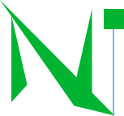

<div id="top"></div>

<!-- BRAND -->
<br />
<div align="center">
    <a href="https://github.com/Niftproj/NiftUI">
        
    </a>

  <h3 align="center">Nift*UI</h3>

  <p align="center">
    Fully Featured Frontend framework based on Vector Graphics. <i>(WORK IN PROGRESS.)</i>
    <br />
    <a href="https://niftproj.github.io/NiftUI">Documentation & Demos »</a>
  </p>

</div>

<!-- FEATURES LIST -->
## Features
* Lightweight
* Vanilla JS
* Supports both Serverless & on Server
* Client Side
* Easy
* Custom Components

<!-- GETTING STARTED -->
## Getting Started
* For Server, see ```docs/easy.html``` & ```docs/pages/easy.js```, it is based on module. (Actually, due to CORS security policy, module objs can only run into server mode.)
* For Serverless, see ```docs/index.html``` or ```docs/shapes.html``` & ```docs/pages/landing.js``` or ```docs/pages/shapes.js```, it is normal as standard js, It can also used in Server mode.

<!-- LICENSE -->
## License

Distributed under the MIT License. See `LICENSE.txt` for more information.